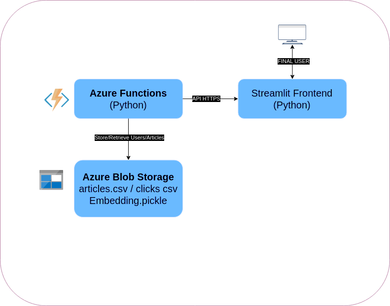
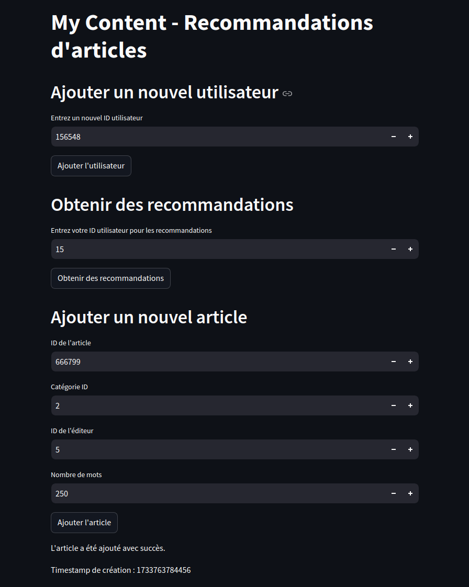
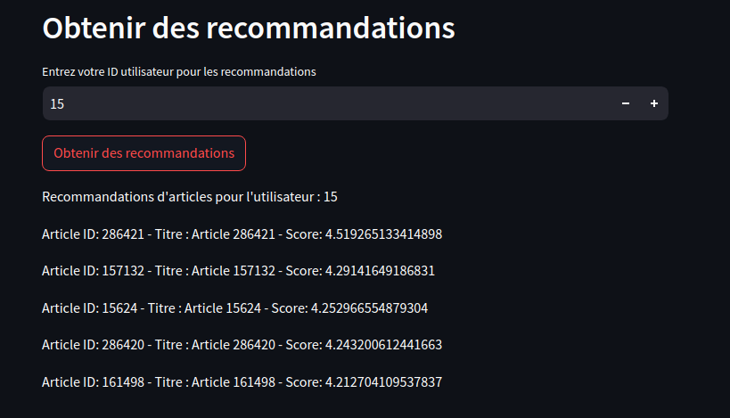

"""
# **Recommandation de Contenus - My Content**

Bienvenue dans le projet **My Content**, une application simple qui recommande des articles pertinents pour encourager la lecture. Cette version est un **MVP** basé sur une architecture cloud minimaliste pour tester les recommandations de contenus.

---

## **Fonctionnalités**
- Recommandation personnalisée de 5 articles pour chaque utilisateur.
- Interface utilisateur simple développée avec **Streamlit**.
- Architecture déployée avec **Azure Functions** et **Azure Blob Storage**.

---

## **Architecture Technique Déployée**

Voici l'architecture actuelle du projet :

- **Azure Functions :** Gestion des requêtes de recommandation.
- **Azure Blob Storage :** Stockage des données des articles et des modèles.
- **Streamlit :** Interface utilisateur pour afficher les recommandations.

---

## **Démonstration**

### Interface Utilisateur
Une interface utilisateur simple et intuitive :

### Recommandations
Une sélection de 5 articles personnalisés pour un utilisateur :

